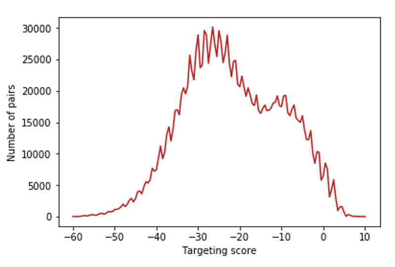
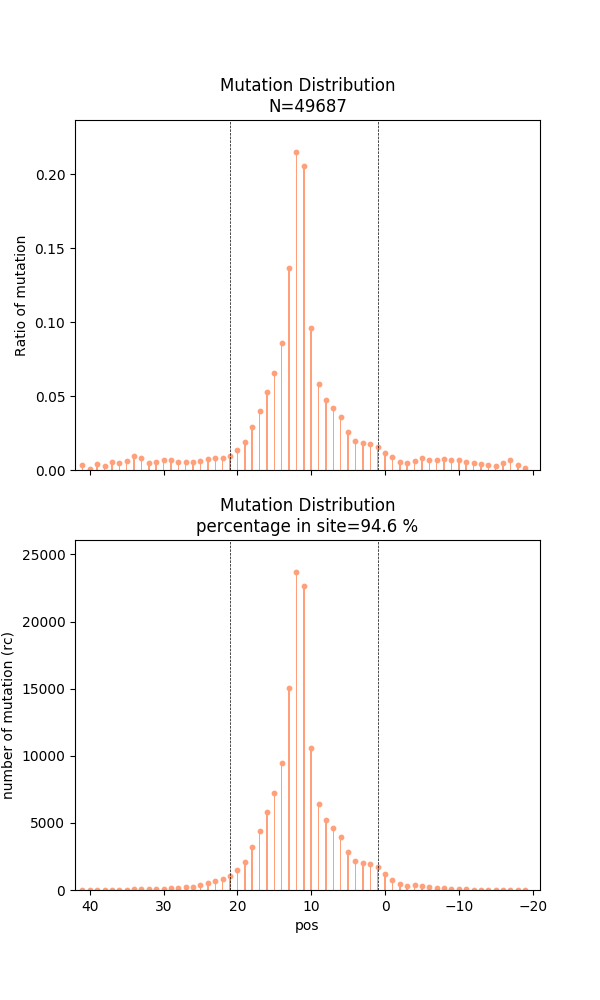
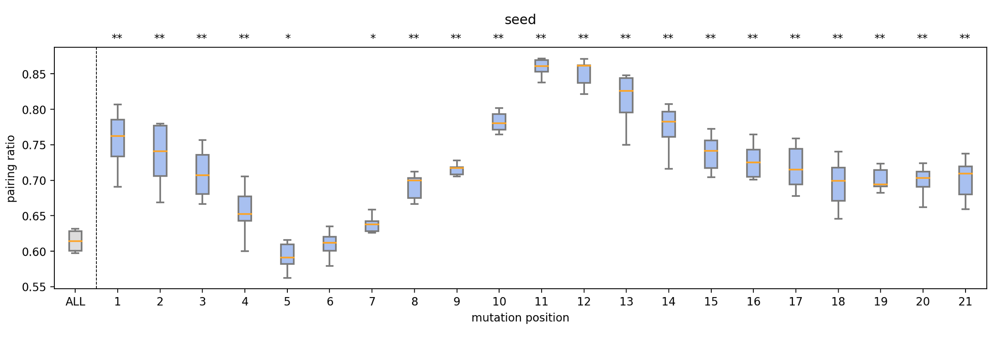
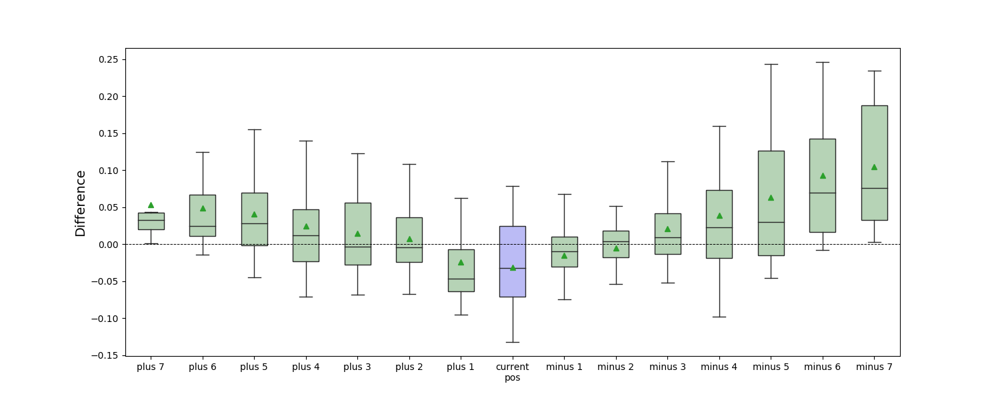
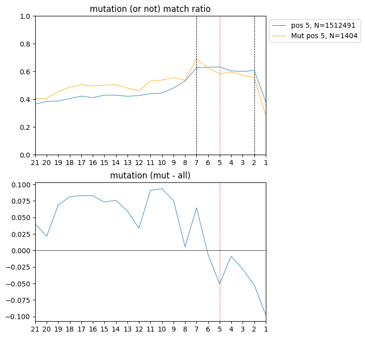
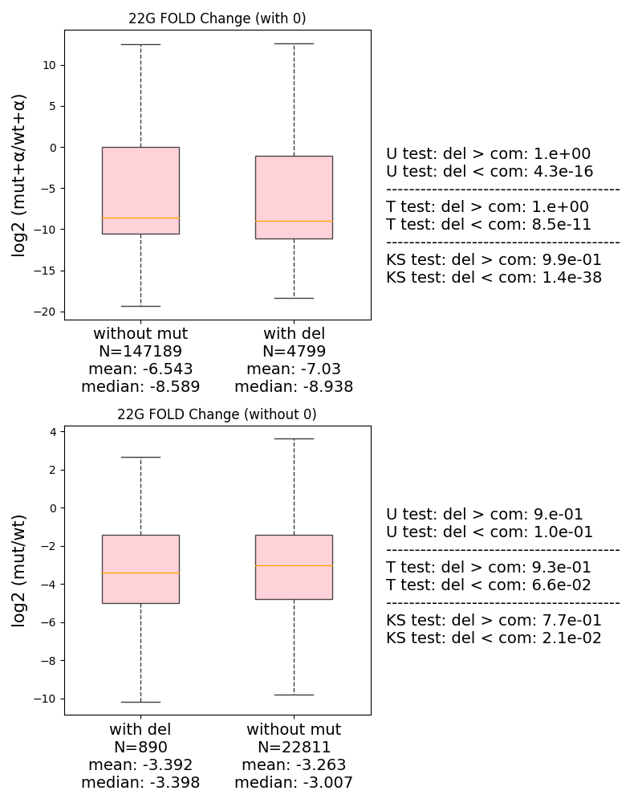
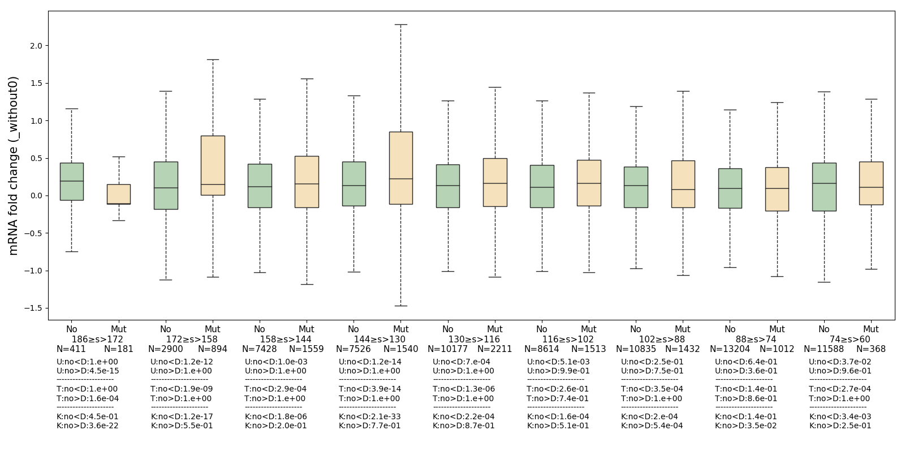
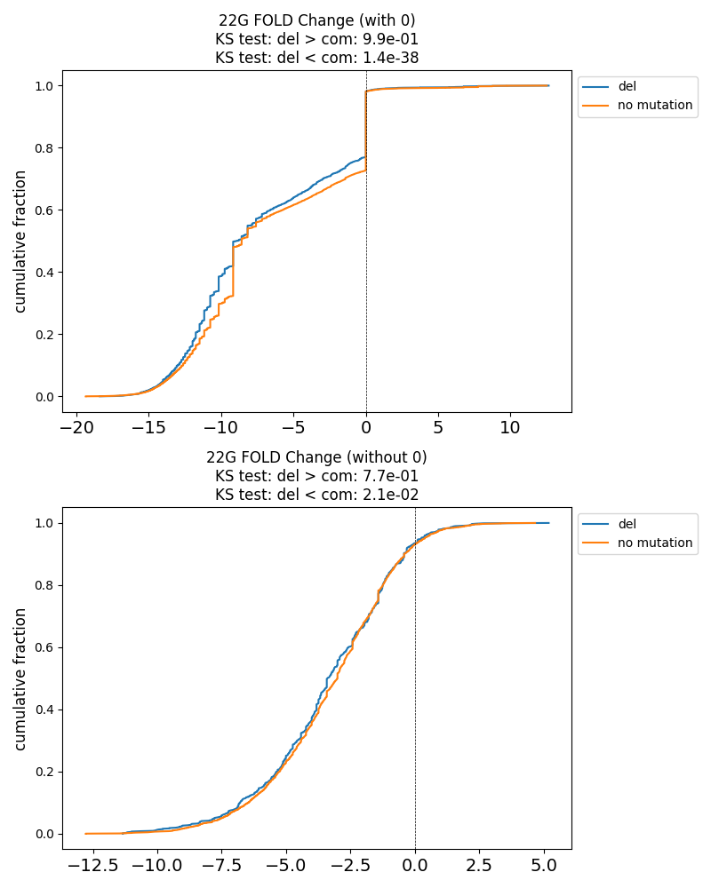

# MutaCLASH

## Description
The **MutaCLASH** project is designed to detect the coordinates of Crosslink Induced Mutation Sites (CIMS) in NGS data. It provides a comprehensive analysis pipeline for identifying mutation sites and binding sites in hybrid-reads derived from CLASH or iCLIP experiments.

## Features
- Uses [ChiRA](https://github.com/pavanvidem/chira) to identify suitable hybrid-reads.
- Detects mutation information using [Bowtie2](https://bowtie-bio.sourceforge.net/bowtie2/manual.shtml) and [BWA](https://bio-bwa.sourceforge.net).
- Utilizes algorithms such as [pirScan](http://cosbi4.ee.ncku.edu.tw/pirScan/), [miRanda](https://bioweb.pasteur.fr/packages/pack@miRanda@3.3a), and [RNAup](https://github.com/ViennaRNA/ViennaRNA) to identify binding sites.
- Generates visualizations of the distribution of mutations.

## Usage
### MutaCLASH.sh
To run only MutaCLASH pipeline, execute the following command:
```bash
sh MutaCLASH.sh --input <input file> --regulator <regulator file> --transcript <transcript file> [--len <min hybrid length>] [--slen <max hybrid length>] [--link <adapter sequence>] [--trim <phred score>]
```
**required arguments:**
- **input file**: NGS data in FASTQ format.
- **regulator file**: regulator file in FASTA format.
- **transcript file**: transcript file in FASTA format.

**optional arguments(preprocessing):**
- **len**: Minimum hybrid length (default: 17).
- **slen**: Maximum hybrid length (default: 70).
- **link**: Adapter sequence (default: "None").
- **trim**: Phred score (default: 30).

MutaCLASH.sh will generate a .csv file with `CLASH read sequence,Target RNA Name,Regulator RNA Name,Target RNA Region Found in CLASH Read,Region on CLASH Read identified as Target RNA,Region on CLASH Read identified as Regulator RNA,Regulator RNA Region Found in CLASH Read,remain_seq,regulator_seq,pirscan_target_endpos,pirScan score,raw_regulator_seq,idx,read Site-Level Preprocessing (Read Count = 1),hybrid0,Deletion Sites on mRNA (Absolute Positions),Mismatch Sites on mRNA (Absolute Positions),count,nor_readcount,nor_count,overlap,Extended Clash Identified Region Start Position (miRanda),Extended Clash Identified Region End Position (miRanda),mir_energy,miRanda score,miRanda Defined Binding Region (Relative to Extended Clash Identified Region),Transcript Binding Sequence (miRanda),Regulator Binding Sequence (miRanda),Extended Clash Identified Region Start Position (RNAup),Extended Clash Identified Region End Position (RNAup),Regulator Binding Sequence (RNAup),Transcript Binding Sequence (RNAup),RNAup Defined Binding Region (Relative to Clash Identified Region),RNAup Binding Energy,pirscan_target_pos,pir_target_mRNA_region,mRNA Length,hybrid_read,Mutation Sites on mRNA (Deletion + Mismatch, Absolute Positions)` columns

example:
| CLASH read sequence | Target RNA Name | Regulator RNA Name | Target RNA Region Found in CLASH Read | Region on CLASH Read identified as Target RNA | Region on CLASH Read identified as Regulator RNA | Regulator RNA Region Found in CLASH Read | remain_seq | regulator_seq | pirscan_target_endpos | pirScan score | raw_regulator_seq | idx | read Site-Level Preprocessing (Read Count = 1) | hybrid0 | Deletion Sites on mRNA (Absolute Positions) | Mismatch Sites on mRNA (Absolute Positions) | count | nor_readcount | nor_count | overlap | Extended Clash Identified Region Start Position (miRanda) | Extended Clash Identified Region End Position (miRanda) | mir_energy | miRanda score | miRanda Defined Binding Region (Relative to Extended Clash Identified Region) | Transcript Binding Sequence (miRanda) | Regulator Binding Sequence (miRanda) | Extended Clash Identified Region Start Position (RNAup) | Extended Clash Identified Region End Position (RNAup) | Regulator Binding Sequence (RNAup) | Transcript Binding Sequence (RNAup) | RNAup Defined Binding Region (Relative to Clash Identified Region) | RNAup Binding Energy | pirscan_target_pos | pir_target_mRNA_region | mRNA Length | hybrid_read | Mutation Sites on mRNA (Deletion + Mismatch, Absolute Positions) |
|---------------------|----------------|------------------|--------------------------------------|-----------------------------------------------|-----------------------------------------------|----------------------------------------|------------|--------------|------------------------|--------------|-----------------|-----|--------------------------------------------------|---------|--------------------------------------------|--------------------------------------------|-------|--------------|----------|---------|---------------------------------------------------|---------------------------------------------------|------------|--------------|---------------------------------------------------------|----------------------------------|--------------------------------|--------------------------------------------------|--------------------------------------------------|---------------------------------|---------------------------------|------------------------------------------------------|------------------|-------------------|----------------------|-----------|-------------|--------------------------------------------------|
| AAAAACACCGTCTTCCTCCAGTGGAGGCCTGGTTGTTTG | Y45F10D.12.1 | Y40H7A.12b | 427-446 | 2-21 | 1-18 | 22-39 | AAAACACCGTCTTCCTCCAG | TGGAGGCCTGGTTGTTTGTGC | 445 | -27.5 | TGGAGGCCTGGTTGTTTGTGC | 0 | 6 | 1656 | [] | [] | 1 | 6.0 | 1.0 | 0 | 425 | 446 | -13.83 | 109.0 | 426-442 | --gaAAAC-ACC-GTCTTCCt | cgtgTTTGTTGGTCCGGAGGt | 425 | 446 | CGTGTTTGTTGGT--CCGGAGGT | --GAAAAC-ACCGTCTTCCTCCA | 426-445 | -14.54 | 426-446 | GAAAACACCGTCTTCCTCCAG | 657 | Y45F10D.12.1_Y40H7A.12b | [] |
| AAAAACATCCATGCCCTCCAATCGTATTGGAGGCCTGGTTGTTTG | C27A2.3.1 | Y40H7A.12b | 320-343 | 1-24 | 1-18 | 28-45 | AAAAACATCCATGCCCTCCAATCG | TGGAGGCCTGGTTGTTTGTGC | 341 | -28.5 | TGGAGGCCTGGTTGTTTGTGC | 1 | 3 | 1747 | [] | [334] | 1 | 3.0 | 1.0 | 0 | 319 | 342 | -19.44 | 122.0 | 320-339 | --AAAAACATCCATGCTCTCCa | cgTGTTTGTTGGT-CCGGAGGt | 319 | 342 | CGTGTTTGTTGGTCCG-GAGGT | --AAAAACATCCATGCTCTCCA | 320-339 | -18.29 | 322-342 | AAACATCCATGCTCTCCAATC | 937 | C27A2.3.1_Y40H7A.12b | [334] |


### run_all.sh
To run the MutaCLASH pipeline, get abundance information and see figure result, execute the following command:
```bash
sh run_all.sh --input <input file> --regulator <regulator file> --transcript <transcript file> --algorithm <algorithm> --abundance_type <abundance analysis type> [--len <min hybrid length>] [--slen <max hybrid length>] [--link <adapter sequence>] [--trim <phred score>]
```
**required arguments:**
- **input file:** NGS data in FASTQ format.
- **regulator file**: regulator file in FASTA format.
- **transcript file**: transcript file in FASTA format.
- **algorithm**: Algorithm used to predict binding sites, which can be `pirScan, miRanda, RNAup`.
- **abundance analysis type**: Method used to analyze abundance, which can be `abu, region, site, up` refers to "mRNA abundance" (check more details about this in `pipeline/add_abundance/abu_data/`), and 22G-RNA abundance (WAGO-1 IP) in "CLASH identified region", "pirScan binding site", "RNAup binding site". If this parameter is not specified, abundance analysis will not be executed.

**optional arguments(preprocessing):**
- **len**: Minimum hybrid length (default: 17).
- **slen**: Maximum hybrid length (default: 70).
- **link**: Adapter sequence (default: "None").
- **trim**: Phred score (default: 30).

After executing the command, the pipeline will run and complete all the necessary steps. Please refer to the [examples](https://github.com/RyanCCJ/MutaCLASH/tree/master/examples) we provided.


## Output
The output files are stored in the `data/output/` directory. The directory contains the following files:
- **CSV file**: Contains results with all information fields.
- **Figures:** The final generated figures are stored in the `figure/` subdirectory.
- **Logs**: Records commands, and summarizes the quantity, proportion, and distribution of various mutations, which are stored in the `log/` subdirectory.
- **Intermediate Files:** The intermediate files generated during the analysis are stored in various formats (.csv, etc.) and can be found in their respective tool directories.

### Figures
The output figures generated by the MutaCLASH pipeline include:

- **Score Distribution:** Presents the quantity and trend of different scores.


- **Mutation Distribution:** Provides information on the distribution of mutations, including deletions and substitutions.


- **Pairing Ratio:** Calculates and analyzes the pairing ratios at both global and individual coordinates.  
In statistical testing, ** and * indicate significant differences, with U-test P<0.05 and 0.10, respectively.




- **Abundance Analysis:** Performs abundance analysis, comparing wild-type samples and fold-change measurements.
<!--img src="examples/fig/22G.png" width=300 /-->



- **Cumulative Distribution Function (CDF):** Calculates and visualizes the cumulative distribution function.
<!--img src="examples/fig/22G_CDF.png" width=300 /-->


<!--Please refer to the corresponding tool documentation for more details on the specific output files and their interpretations.-->

## Requirements
Running MutaCLASH require Linux or MacOS. Other Unix environments will probably work but have not been tested. Windows users can use [Windows Subsystem for Linux](https://docs.microsoft.com/en-us/windows/wsl/install-win10).

To install some necessary tools and packages, execute the following command:
```bash
$ apt-get install -y samtools bowtie2
$ pip install -r requirements.txt
```

- SAMtools >= 0.1.19
- Bowtie2 >= 2.4.0
- Python >= 3.5
- bcbio-gff >= 0.6.9
- biopython >= 1.76
- cutadapt >= 2.10
- matplotlib >= 2.2.2
- numpy >= 1.12.1
- pandas >= 0.23.0
- pysam >= 0.20.0
- scipy >= 1.1.0
- seaborn >= 0.9
- statannot = 0.2.3
- tqdm >= 4.64.0
- xlrd >= 1.2.0

## Docker
If you have any concerns about environment setup, feel free to use the Docker version directly.
```bash
$ docker pull ryanccj/mutaclash
$ docker run -it ryanccj/mutaclash
```

Or you can choose to built from this project.
```bash
$ docker build -t <image_name> .
$ docker run -it <image_name>
```

## LICENSE
Please refer to our [MIT license](https://github.com/RyanCCJ/MutaCLASH/blob/master/LICENSE).
